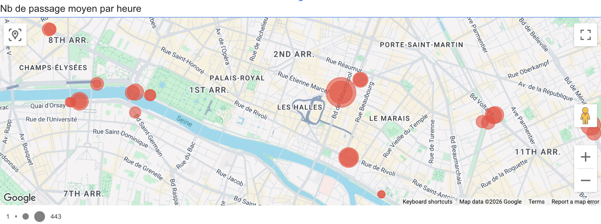

# Portfolio

---
## Analytics Engineering

**Paris Bike Traffic ELT Pipeline & Dashboard**

An automated, end-to-end ELT data pipeline monitoring Parisian bicycle traffic daily. 

- **Extraction & Ingestion:** Automated daily fetch from the Paris Open Data API and zero-cost ingestion into Snowflake using Python and `dlt`.
- **Data Modeling:** Modular SQL transformations, testing, and deduplication handled with `dbt`.
- **Orchestration & CI/CD:** Fully scheduled and tested via GitHub Actions workflows.
- **Visualization:** Interactive tracking and geospatial analysis of counting stations on Looker Studio.

[Interactive Looker Studio Dashboard](https://datastudio.google.com/s/h3fAl80lR2A)

[Link to the GitHub Repository](https://github.com/lpinot9)

---

## Data Analysis

**World Cup 2022 Players Ratings**

[Key Highlights](conclusions.md)

[Link to the full repo](https://github.com/lpinot9/world_cup_2022_ratings)

---

## Machine Learning Ops

An end-to-end MLOps project I built during my bootcamp at Le Wagon that predicts taxi fares in New York City. This repository demonstrates a complete machine learning lifecycle, from data preprocessing and model training to containerized deployment using Docker and FastAPI.

[Link to the front end](https://lpinot9.github.io/taxi-fare-interface)

[Link to the back end repo](https://github.com/lpinot9/taxifare-backend)

---

## AI content generation

**Group final project for le Wagon Data Science Bootcamp**
[Google Slides Presentation - Zero-shot voice conversion](https://docs.google.com/presentation/d/1zvA8LZWQpG-srYzzJqQ6LoWALTCTeiQD-PrTMk3dAkY/edit#slide=id.g1336ead2df3_1_481)

------------------------------------------------------------------------------------------------------------------------------------

