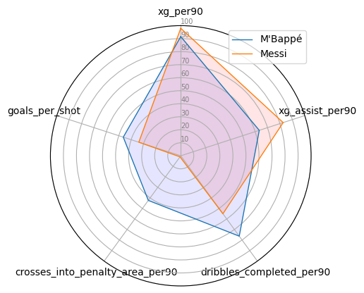

# Portfolio

---

## Data Analysis

**World Cup 2022 PLayer Ratings**

[Key Highlights](conclusions.md)

[Link to the full repo](https://github.com/lpinot9/world_cup_2022_ratings)

---

## AI content generation

**Group final project for le Wagon Data Science Bootcamp**
- [Google Slides Presentation - Zero-shot voice conversion](https://docs.google.com/presentation/d/1zvA8LZWQpG-srYzzJqQ6LoWALTCTeiQD-PrTMk3dAkY/edit#slide=id.g1336ead2df3_1_481)

---

---

Page template forked from <a href="https://github.com/evanca/quick-portfolio">evanca</a>

<!-- Remove above link if you don't want to attibute -->
